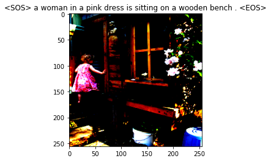

# Image-captioning using Resnet-50, LSTM and Greedy Search


This repository contains the code and the files for the implementation of the Image captioning model. The implementation is similar to proposed in the paper [Show and Tell](https://arxiv.org/abs/1411.4555).

This project is a stepping stone towards the version with Soft attention which has several differences in its implementation. You can check out the attention version [here.](https://github.com/sankalp1999/Image_Captioning) (It contains a deployed caption bot also!!)

- [Running Locally](https://github.com/sankalp1999/Image_Captioning_Without_Attention#how-to-run-on-local-machine)
- [Architecture details](https://github.com/sankalp1999/Image_Captioning_Without_Attention#model-architecture)
- [Examples](https://github.com/sankalp1999/Image_Captioning_Without_Attention#results)
- [References](https://github.com/sankalp1999/Image_Captioning_Without_Attention#inferencetest-time)

---

## How to run on local machine

1. Clone the repository

```bash
git clone https://github.com/sankalp1999/Image_Captioning_Without_Attention.git
cd Image_Captioning_Without_Attention
```

2. Make a new virtual environment (Optional)

```bash
pip install --user virtualenv
```

You can change name from .env to something else.

```bash
virtualenv -p python3 .env
source .env/bin/activate
```

3. Install required dependencies

```bash
pip install -r requirements.txt
```

4. Download the model weights and put in proper folder. You can manually set image path in the inference file or use the static evaluation function in model.

```bash
python inference.py
```

**Weights** [Encoder](https://drive.google.com/file/d/17b-O_d9GZssD38nMwMpd-Cb26fTXQ_Rs/view?usp=sharing)    [Decoder](https://drive.google.com/file/d/1gakiU_Tot40tSor7OtdtK05d5cpJ56TF/view?usp=sharing)

## Model Architecture

### Seq2Seq

This model is a typical example of Seq2Seq modelling where we have an encoder and decoder network. We pass the image through the encoder. Get the feature vector. 
Then, we concatenate the feature vector and embedding and pass it through the decoder.

**Given enough such pairs, the model can easily trained using backpropagation.**


### Encoder

The encoder is a pre-trained Resnet-50. We extract the features from the second last layer after removing the last fully connected layer(which is used for classifcation). The Resnet-50 is trained on the ImageNet set which has 1000 classes.


### Embedding layer

Standard embedding layer. I train my own embedding instead of using pretrained. Local context is probably better. Another reason for not using pre-trained embedding is the large size of those files.

Vocab size : threshold = 5 2994 (Full dataset used for training)

The threshold is the number of occurences of particular word so that it is included in the vocab which is a mapping of words to indices and vice-versa.

### Decoder


The decoder is an LSTM with 2 layers. Pytorch provides nice API for this! You don't have to deal with those equations. 

During train time, the model works by passing the embedding of caption along with the feature vector, getting outputs, getting loss and train by backpropagation.

During test time, we sample word by word.

### Greedy decoding

We predict the caption by always select the prediction with the top probability score.
This often gives right predictions but can lead to suboptimal predictions a lot of times.


Since all the words are dependent on previous predictions, even one suboptimal word in the beginning can complelety change the context/meaning of the caption.

I use the **Beam Search algorithm** in the Show, Attend and Tell version.

### Dataset

Flickr8K- It is a relatively small dataset of 8000 images with 5 captions each. There are two versions found on the web - one with splits and one without splits. I used the latter and created manual split.

---

## Results

### The good (train)




### The not so good( no caption is bad!)


### Inference(test time)


Here, you can see the model can't identify the cat.


It can identify the boat and people.


## References

I referred various blogposts and some Youtube videos for learning. Although, I did this project and Show, Attend and Tell to get better at implementation and apply the concepts I learnt in the [deeplearning.ai](http://deeplearning.ai) specialization.

**Papers**

[Show and Tell](https://arxiv.org/abs/1411.4555)

**Implementations referred**

Stackoverflow for 100's of bugs I faced.

[aladdinpersson](https://github.com/aladdinpersson/Machine-Learning-Collection/tree/master/ML) - He has a Youtube channel on which he makes detailed tutorials on applications using Pytorch and TensorFlow.

---
